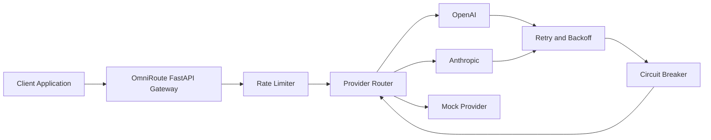
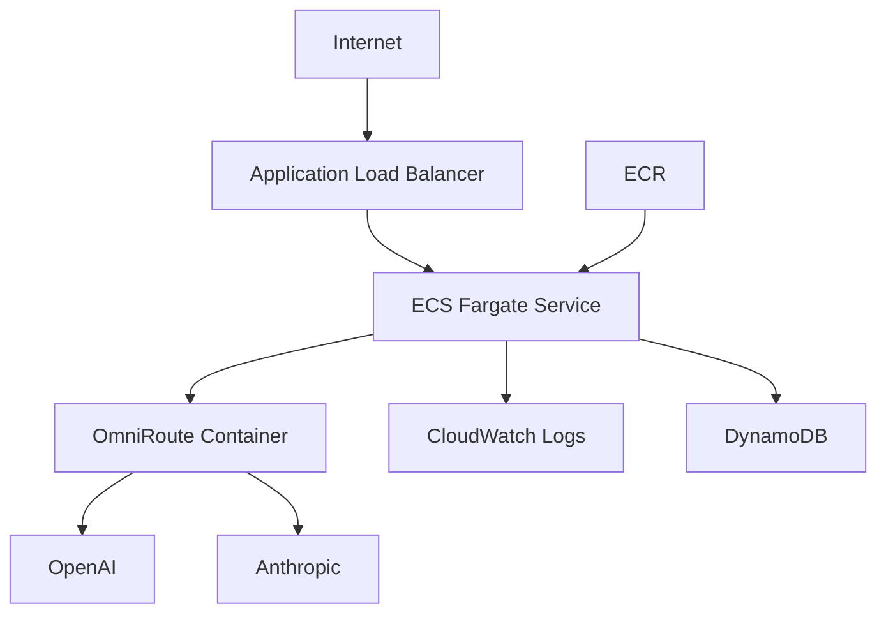

# OmniRoute Cloud

[](https://github.com/wandersonr7/OMNIROUTE-CLOUD/actions/workflows/ci.yml)

OmniRoute Cloud is a multi-provider AI routing gateway and hands-on cloud engineering lab built with Python and FastAPI.

It is used both as a portfolio project and as a practical environment for experimenting with backend engineering, reliability, Docker, CI/CD, Terraform, and AWS architecture.

## What Problem Does It Solve?

Applications that depend directly on a single AI provider can experience problems when that provider has:

- outages
- rate limits
- timeouts
- temporary server errors
- configuration failures

OmniRoute sits between an application and AI providers.

```text
Application
    |
    v
OmniRoute
    |
    +--> OpenAI
    |
    +--> Anthropic
    |
    +--> Mock Provider
```

If one provider is unavailable, OmniRoute can route the request to another available provider.

## How It Works



The local mock provider allows the complete system to be tested without an OpenAI key, Anthropic key, AWS account, or paid API usage.

## Current Features

### API

- OpenAI-compatible `POST /v1/chat/completions`
- `GET /health`
- `GET /health/providers`
- provider selection through `X-OmniRoute-Provider`

### Provider Routing

- OpenAI-compatible provider adapter
- Anthropic provider adapter
- local mock provider
- normalized chat completion responses
- automatic provider failover

### Reliability

- configurable provider timeout
- automatic retries
- exponential retry backoff
- circuit breaker per provider
- provider health tracking
- automatic failover

### Application Protection

- in-memory rate limiting
- request IDs
- structured JSON logging
- error handling

### Engineering

- automated pytest tests
- Docker
- Docker Compose
- GitHub Actions CI
- Python package configuration

### Infrastructure as Code

Terraform definitions currently include:

- Amazon ECR
- Amazon ECS
- AWS Fargate
- IAM roles
- CloudWatch Logs
- DynamoDB
- VPC
- public subnets
- Internet Gateway
- route tables
- security groups
- Application Load Balancer
- target group
- load balancer health checks

The AWS infrastructure is defined but is not currently deployed.

## Lab Purpose

OmniRoute Cloud is also a hands-on engineering laboratory.

The repository is intentionally designed so new backend, cloud, DevOps, reliability, networking, and security concepts can be implemented and tested incrementally.

Current and future lab areas include:

- API gateway architecture
- provider routing
- failover
- retries
- exponential backoff
- circuit breakers
- Docker
- CI/CD
- Terraform
- AWS ECS and Fargate
- VPC networking
- IAM
- observability
- secrets management
- autoscaling
- distributed rate limiting
- security hardening

The goal is to keep the project functional while continuously adding production-oriented engineering patterns.

## Quick Start

The default configuration uses the local mock provider.

No paid AI API is required.

### Docker

Clone the repository:

```bash
git clone https://github.com/wandersonr7/OMNIROUTE-CLOUD.git
cd OMNIROUTE-CLOUD
```

Start the service:

```bash
docker compose up --build
```

The API will be available at:

```text
http://localhost:8080
```

Test the health endpoint:

```bash
curl http://localhost:8080/health
```

Example response:

```json
{
  "status": "ok",
  "service": "omniroute-cloud",
  "default_provider": "mock"
}
```

## Send a Test Request

```bash
curl -X POST http://localhost:8080/v1/chat/completions \
  -H "Content-Type: application/json" \
  -d '{"model":"mock-1","messages":[{"role":"user","content":"Hello OmniRoute"}]}'
```

The request is handled by the local mock provider.

## Test Provider Failover

You can explicitly request OpenAI:

```bash
curl -X POST http://localhost:8080/v1/chat/completions \
  -H "Content-Type: application/json" \
  -H "X-OmniRoute-Provider: openai" \
  -d '{"model":"mock-1","messages":[{"role":"user","content":"Testing provider failover"}]}'
```

If OpenAI is not configured, OmniRoute can fall back to an available provider.

```text
Client
  |
  v
OmniRoute
  |
  v
OpenAI unavailable
  |
  v
Failover
  |
  v
Mock Provider
  |
  v
Response
```

## Provider Health

Check the state of configured providers:

```bash
curl http://localhost:8080/health/providers
```

Example:

```json
{
  "providers": {
    "mock": {
      "status": "available",
      "configured": true,
      "circuit_open": false
    },
    "openai": {
      "status": "not_configured",
      "configured": false,
      "circuit_open": false
    },
    "anthropic": {
      "status": "not_configured",
      "configured": false,
      "circuit_open": false
    }
  }
}
```

## Run with Python

Create a virtual environment:

```bash
python -m venv .venv
```

Windows PowerShell:

```powershell
.\.venv\Scripts\Activate.ps1
```

Install the project:

```bash
python -m pip install -e ".[dev]"
```

Start OmniRoute:

```bash
python -m uvicorn app.main:app --reload --port 8080
```

## Tests

Run:

```bash
python -m pytest
```

The automated test suite covers API behavior and reliability components.

## Continuous Integration

GitHub Actions validates pushes and pull requests.

The Python CI job performs:

```text
Install dependencies
       |
       v
Compile Python
       |
       v
Run pytest
       |
       v
Build Docker image
```

The Terraform CI job performs:

```text
terraform fmt -check
       |
       v
terraform init -backend=false
       |
       v
terraform validate
```

The CI pipeline does not deploy AWS infrastructure.

## AWS Architecture

A future AWS deployment is represented with Terraform.



Infrastructure creation is intentionally disabled by default where practical.

```text
create_network = false
create_alb = false
create_ecs_service = false
```

No AWS resources are created by cloning, testing, or validating the repository.

## Project Structure

```text
OMNIROUTE-CLOUD/
|
+-- app/
|   +-- main.py
|   +-- config.py
|   +-- providers.py
|   +-- routing.py
|   +-- circuit_breaker.py
|   +-- rate_limit.py
|   +-- logging_config.py
|   +-- models.py
|
+-- tests/
|
+-- terraform/
|
+-- docs/
|
+-- .github/workflows/
|
+-- Dockerfile
+-- docker-compose.yml
+-- pyproject.toml
+-- SECURITY.md
+-- README.md
```

## Configuration

Examples of supported environment variables:

```text
OMNIROUTE_DEFAULT_PROVIDER
OMNIROUTE_RATE_LIMIT_PER_MINUTE

OMNIROUTE_PROVIDER_TIMEOUT_SECONDS
OMNIROUTE_PROVIDER_MAX_RETRIES
OMNIROUTE_PROVIDER_RETRY_BACKOFF_SECONDS

OMNIROUTE_CIRCUIT_BREAKER_FAILURE_THRESHOLD
OMNIROUTE_CIRCUIT_BREAKER_RECOVERY_TIMEOUT_SECONDS

OPENAI_API_KEY
OPENAI_BASE_URL
OPENAI_DEFAULT_MODEL

ANTHROPIC_API_KEY
ANTHROPIC_BASE_URL
ANTHROPIC_DEFAULT_MODEL
```

See `.env.example` for local configuration.

## Security

Secrets must never be committed to the repository.

Local `.env` files are excluded from Git.

Production credentials should eventually use a dedicated secrets-management solution such as AWS Secrets Manager.

See [SECURITY.md](SECURITY.md).

## Deployment Status

The application currently runs locally.

Terraform is used to define and validate a possible AWS architecture.

The AWS environment has not been deployed.

This means the project can currently be tested without:

- an AWS account
- AWS charges
- OpenAI credits
- Anthropic credits

## Roadmap

Planned lab and portfolio improvements include:

- client API-key authentication
- distributed rate limiting
- request metrics
- provider metrics
- persistent request telemetry
- intelligent provider selection
- AWS Secrets Manager
- HTTPS with ACM
- DNS
- ECS autoscaling
- CloudWatch dashboards
- CloudWatch alarms
- deployment automation
- distributed provider health state

## Skills Demonstrated

OmniRoute Cloud demonstrates practical work with:

- Python
- FastAPI
- REST APIs
- asynchronous HTTP
- distributed-system reliability concepts
- retries
- exponential backoff
- circuit breakers
- failover
- API rate limiting
- structured logging
- automated testing
- Docker
- GitHub Actions
- Terraform
- AWS ECS
- AWS Fargate
- Amazon ECR
- Application Load Balancers
- VPC networking
- IAM
- DynamoDB
- CloudWatch

## Documentation

Additional technical documentation:

- [Architecture](docs/architecture.md)
- [Security Policy](SECURITY.md)
- [Terraform Infrastructure](terraform/README.md)
- [Roadmap](docs/ROADMAP.md)

## Project Status

OmniRoute Cloud is an actively developed portfolio project and engineering lab.

The repository is intended to evolve as new cloud and backend concepts are implemented, tested, documented, and validated.