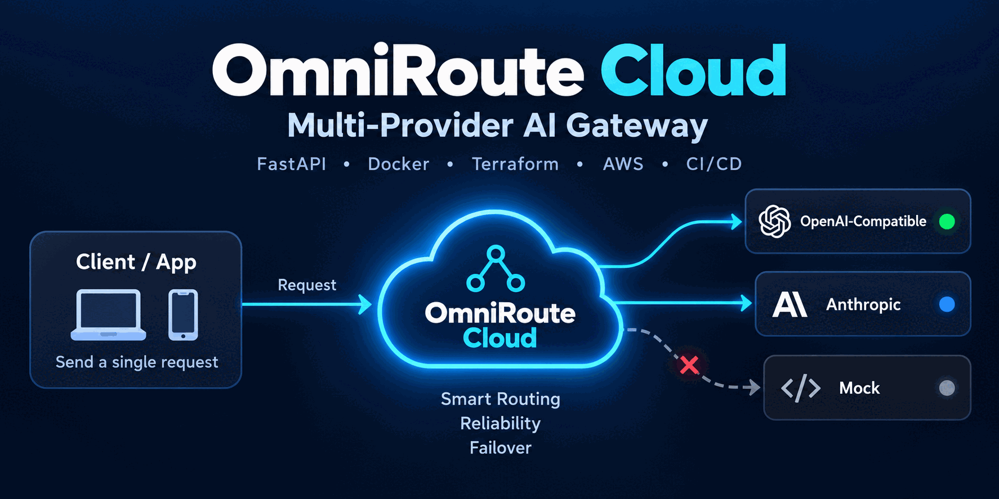
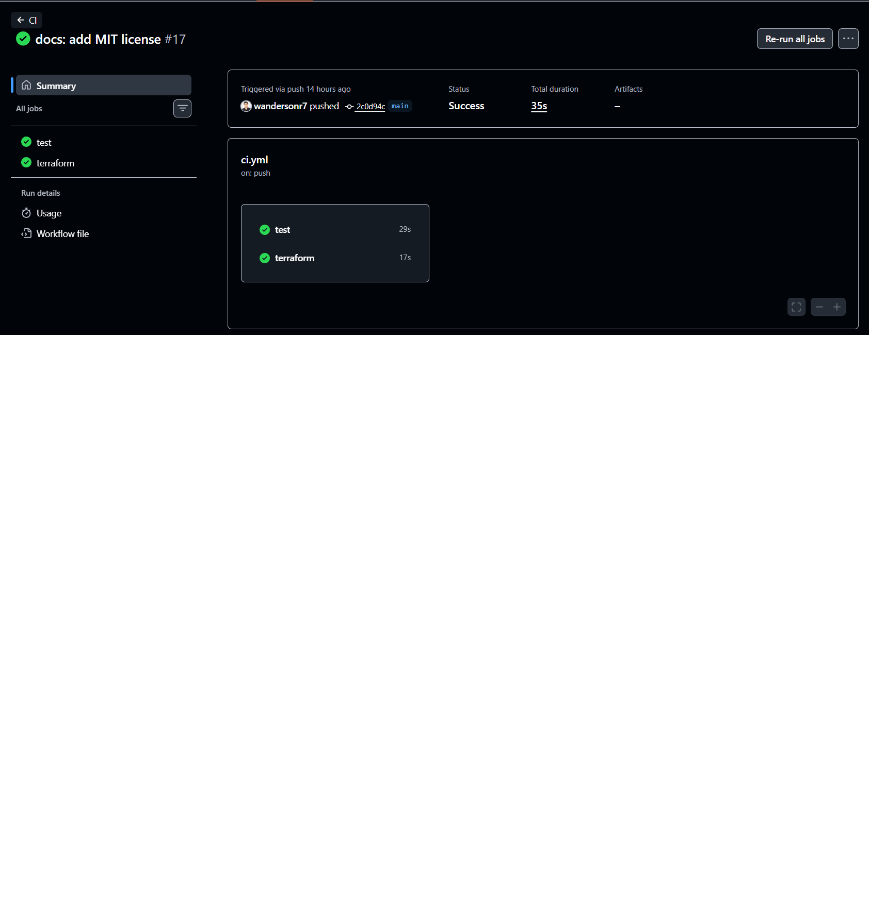
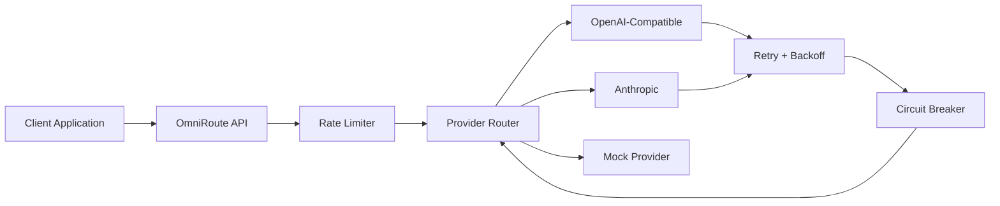
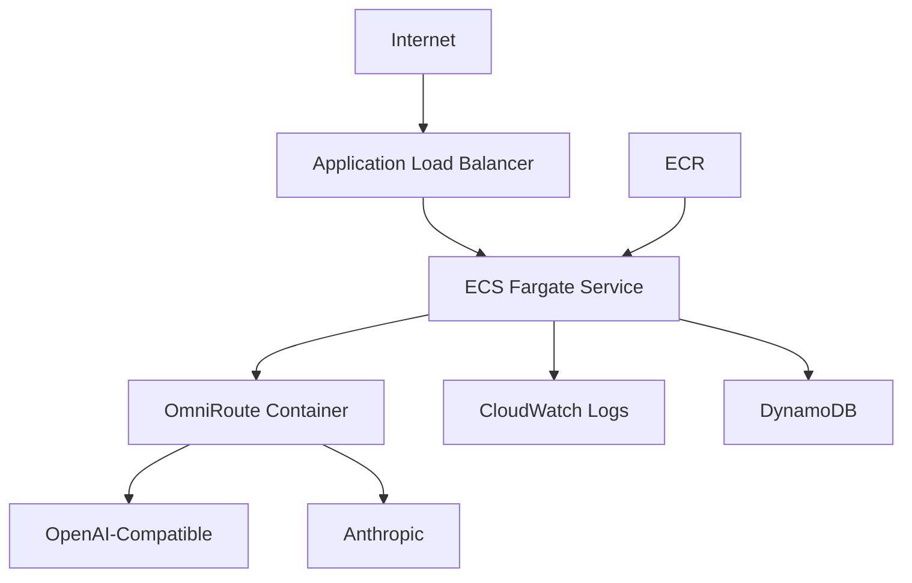

# OmniRoute Cloud

[](https://github.com/wandersonr7/OMNIROUTE-CLOUD/actions/workflows/ci.yml)


**Multi-provider AI routing gateway and hands-on cloud engineering lab built with Python, FastAPI, Docker, Terraform, GitHub Actions, and AWS architecture.**

OmniRoute Cloud sits between an application and multiple AI providers. It handles provider selection, retries, exponential backoff, health tracking, circuit breaking, and automatic failover.

<p align="center">
  
</p>

---

## Project Overview

A normal application may depend directly on one AI provider:

```text
Application --> AI Provider
```

If that provider becomes unavailable, the application can fail.

OmniRoute introduces a reliability layer:

```text
Application
    |
    v
OmniRoute
    |
    +--> OpenAI-Compatible
    |
    +--> Anthropic
    |
    +--> Mock Provider
```

The application sends one request to OmniRoute. OmniRoute handles provider routing and reliability logic behind the scenes.

---

## Portfolio Demo

The project can be tested locally without an AWS account or paid AI API.

### CI Pipeline

GitHub Actions automatically validates Python, tests, Docker builds, and Terraform.

<p align="center">
  
</p>

The current CI pipeline includes:

```text
Python
  |
  +--> Install dependencies
  +--> Compile application
  +--> Run pytest
  +--> Build Docker image

Terraform
  |
  +--> terraform fmt -check
  +--> terraform init -backend=false
  +--> terraform validate
```

### Provider Health

OmniRoute exposes provider health information through:

```text
GET /health/providers
```

<p align="center">
  
</p>

The local configuration shows:

```text
Mock       -> available
OpenAI     -> not configured
Anthropic  -> not configured
```

### Automatic Failover

A request can explicitly ask for OpenAI even when OpenAI is unavailable.

OmniRoute detects that the provider cannot be used and falls back to the local mock provider.

<p align="center">
  
</p>

Demonstrated flow:

```text
Requested provider: OpenAI
        |
        v
OpenAI not configured
        |
        v
OmniRoute failover
        |
        v
Mock provider
        |
        v
Successful response
```

Example result:

```text
Response: OmniRoute mock response: Portfolio failover demo
```

---

## Current Features

### API

- OpenAI-compatible `POST /v1/chat/completions`
- `GET /health`
- `GET /health/providers`
- provider selection through `X-OmniRoute-Provider`
- normalized chat completion responses

### Provider Routing

- OpenAI-compatible provider adapter
- Anthropic provider adapter
- local mock provider
- configurable default provider
- automatic provider failover

### Reliability

- provider timeouts
- automatic retries
- exponential retry backoff
- per-provider circuit breaker
- provider health tracking
- automatic failover

### Application Protection

- in-memory rate limiting
- request IDs
- structured JSON logging
- centralized error handling

### Engineering

- automated pytest suite
- Docker
- Docker Compose
- GitHub Actions
- Terraform validation in CI
- MIT License

---

## Reliability Flow



The system attempts to prevent a temporary provider problem from becoming an application-wide failure.

---

## Quick Start

No OpenAI key, Anthropic key, or AWS account is required for the default local demo.

### Clone

```bash
git clone https://github.com/wandersonr7/OMNIROUTE-CLOUD.git
cd OMNIROUTE-CLOUD
```

### Run with Docker

```bash
docker compose up --build
```

The service will be available at:

```text
http://localhost:8080
```

Test it:

```bash
curl http://localhost:8080/health
```

Example response:

```json
{
  "status": "ok",
  "service": "omniroute-cloud",
  "default_provider": "mock"
}
```

---

## Send a Chat Request

```bash
curl -X POST http://localhost:8080/v1/chat/completions \
  -H "Content-Type: application/json" \
  -d '{"model":"mock-1","messages":[{"role":"user","content":"Hello OmniRoute"}]}'
```

Example mock response:

```text
OmniRoute mock response: Hello OmniRoute
```

---

## Test Failover

Request OpenAI explicitly:

```bash
curl -X POST http://localhost:8080/v1/chat/completions \
  -H "Content-Type: application/json" \
  -H "X-OmniRoute-Provider: openai" \
  -d '{"model":"mock-1","messages":[{"role":"user","content":"Testing provider failover"}]}'
```

If OpenAI is not configured, OmniRoute can continue using another available provider.

```text
Client
  |
  v
OmniRoute
  |
  v
OpenAI unavailable
  |
  v
Failover
  |
  v
Mock Provider
  |
  v
Response
```

---

## Run with Python

Create a virtual environment:

```bash
python -m venv .venv
```

Windows PowerShell:

```powershell
.\.venv\Scripts\Activate.ps1
```

Install the project:

```bash
python -m pip install -e ".[dev]"
```

Start the API:

```bash
python -m uvicorn app.main:app --reload --port 8080
```

---

## Tests

Run:

```bash
python -m pytest
```

The automated suite currently covers API behavior, provider routing, failover, retry logic, and circuit breaker behavior.

---

## AWS Infrastructure as Code

The repository includes Terraform definitions for a future AWS deployment.

Current infrastructure definitions include:

- Amazon ECR
- Amazon ECS
- AWS Fargate
- IAM roles
- CloudWatch Logs
- DynamoDB
- VPC
- public subnets
- Internet Gateway
- route tables
- security groups
- Application Load Balancer
- target group
- health checks

Architecture:



The AWS environment is **not currently deployed**.

Terraform is used to design and validate the architecture without creating cloud resources.

Infrastructure creation is disabled by default where practical:

```text
create_network = false
create_alb = false
create_ecs_service = false
```

---

## Terraform Validation

Local validation:

```bash
terraform -chdir=terraform fmt -check
terraform -chdir=terraform validate
```

GitHub Actions performs Terraform validation automatically.

No `terraform apply` operation is executed by CI.

---

## Project Structure

```text
OMNIROUTE-CLOUD/
|
+-- app/
|   +-- main.py
|   +-- config.py
|   +-- providers.py
|   +-- routing.py
|   +-- circuit_breaker.py
|   +-- rate_limit.py
|   +-- logging_config.py
|   +-- models.py
|
+-- tests/
|
+-- terraform/
|
+-- docs/
|   +-- images/
|       +-- architecture-preview.png
|       +-- ci-passing.png
|       +-- provider-health.png
|       +-- failover-demo.png
|
+-- .github/
|   +-- workflows/
|
+-- Dockerfile
+-- docker-compose.yml
+-- pyproject.toml
+-- SECURITY.md
+-- LICENSE
+-- README.md
```

---

## Configuration

OmniRoute is configured through environment variables.

Examples:

```text
OMNIROUTE_DEFAULT_PROVIDER
OMNIROUTE_RATE_LIMIT_PER_MINUTE

OMNIROUTE_PROVIDER_TIMEOUT_SECONDS
OMNIROUTE_PROVIDER_MAX_RETRIES
OMNIROUTE_PROVIDER_RETRY_BACKOFF_SECONDS

OMNIROUTE_CIRCUIT_BREAKER_FAILURE_THRESHOLD
OMNIROUTE_CIRCUIT_BREAKER_RECOVERY_TIMEOUT_SECONDS

OPENAI_API_KEY
OPENAI_BASE_URL
OPENAI_DEFAULT_MODEL

ANTHROPIC_API_KEY
ANTHROPIC_BASE_URL
ANTHROPIC_DEFAULT_MODEL
```

See:

```text
.env.example
```

for local configuration examples.

---

## Security

Secrets must never be committed to the repository.

The repository ignores local `.env` files and Terraform state files.

Production secrets should eventually be stored using a dedicated secrets-management service such as AWS Secrets Manager.

Before making the repository public, the Git history was reviewed and rewritten to remove personal email addresses from commit metadata.

See:

[SECURITY.md](SECURITY.md)

---

## Cloud Engineering Lab

OmniRoute Cloud is both a portfolio project and a hands-on engineering laboratory.

The repository is used to experiment with production-oriented concepts such as:

- API gateway architecture
- provider routing
- reliability engineering
- retries
- backoff
- circuit breakers
- failover
- containerization
- CI/CD
- infrastructure as code
- AWS networking
- IAM
- monitoring
- secrets management
- distributed systems

The goal is to incrementally implement, test, document, and validate each concept.

---

## Roadmap

Planned improvements include:

- client API-key authentication
- distributed rate limiting
- request metrics
- provider metrics
- persistent request telemetry
- smarter provider selection
- AWS Secrets Manager
- HTTPS with ACM
- DNS integration
- ECS autoscaling
- CloudWatch dashboards
- CloudWatch alarms
- deployment automation
- distributed provider health state

---

## Skills Demonstrated

This project demonstrates practical work with:

- Python
- FastAPI
- REST APIs
- asynchronous HTTP
- API gateway patterns
- reliability engineering
- retries
- exponential backoff
- circuit breakers
- failover
- rate limiting
- structured logging
- automated testing
- Git
- GitHub
- GitHub Actions
- Docker
- Terraform
- AWS architecture
- ECS
- Fargate
- ECR
- VPC networking
- Application Load Balancers
- IAM
- DynamoDB
- CloudWatch

---

## Documentation

Additional documentation:

- [Architecture](docs/architecture.md)
- [Terraform Infrastructure](terraform/README.md)
- [Security Policy](SECURITY.md)
- [Roadmap](docs/ROADMAP.md)

---

## Project Status

**Active portfolio project and cloud engineering lab.**

The application runs locally today and the AWS architecture is defined through Terraform for future deployment.

The project can be cloned, tested, and evaluated without requiring paid cloud or AI services.

---

## License

MIT License.